# Gameboy Emulator

# Features

What works:

* CPU
* Graphics: background, window, sprites
* DMA
* MBC1, MBC2, MBC3 mappers
* Timer
* Controls
* APU

What doesn't work:

* Link cable
* SGB(Super Game Boy)
* CGB(Gameboy Color)

# Screenshots

I don't use four shades of grey like on orginal hardware. Instead I've picked four more lively colors. It doesn't always look good when games try to do edge smooting(visible on Pokemon menu screen).

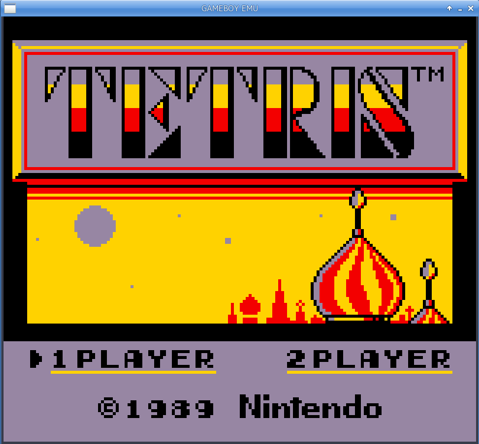
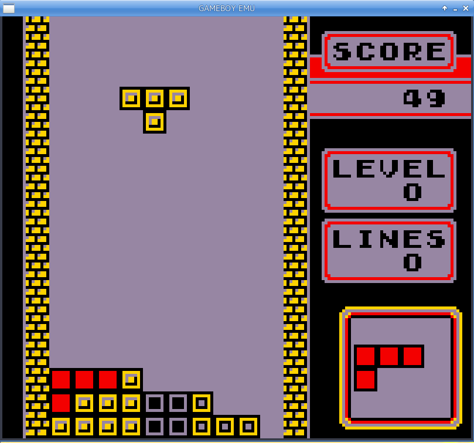
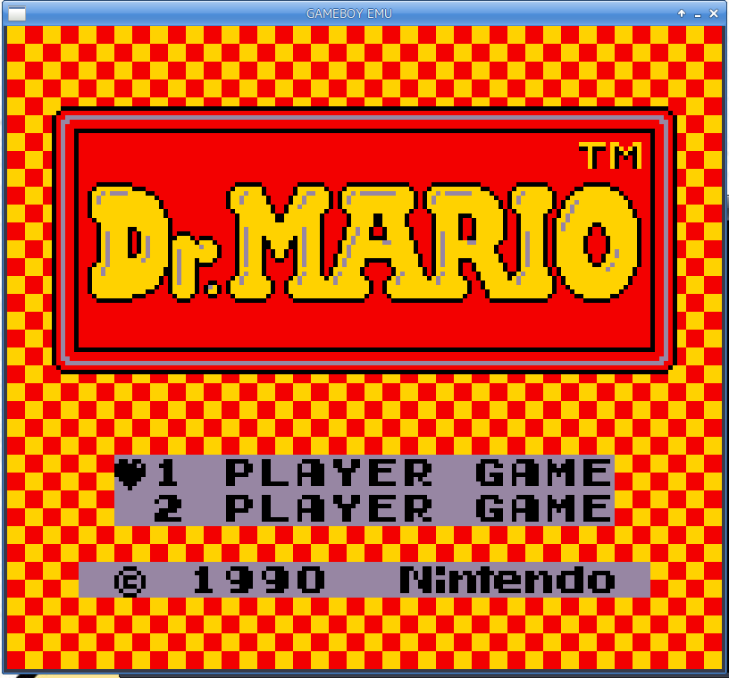
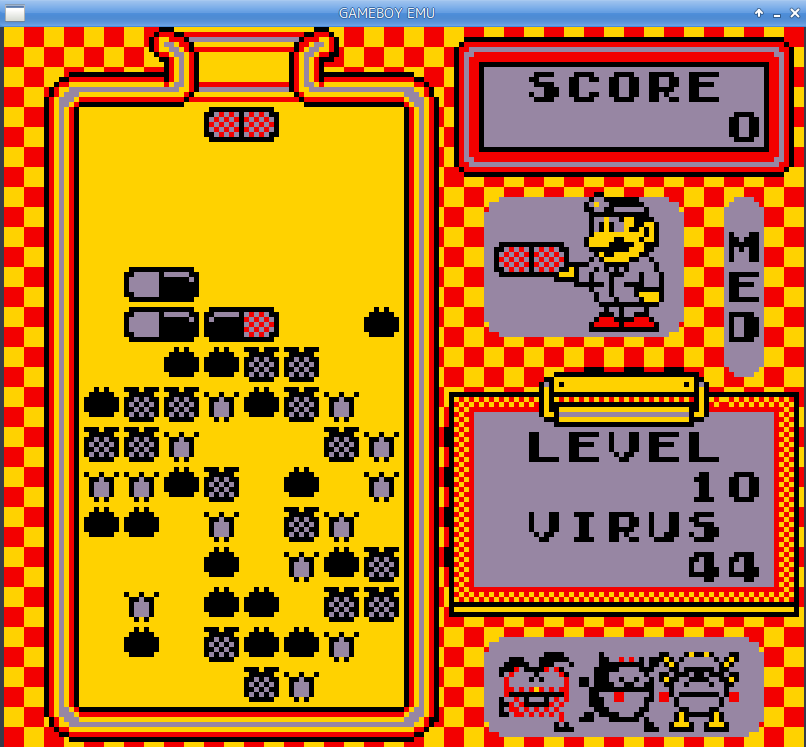
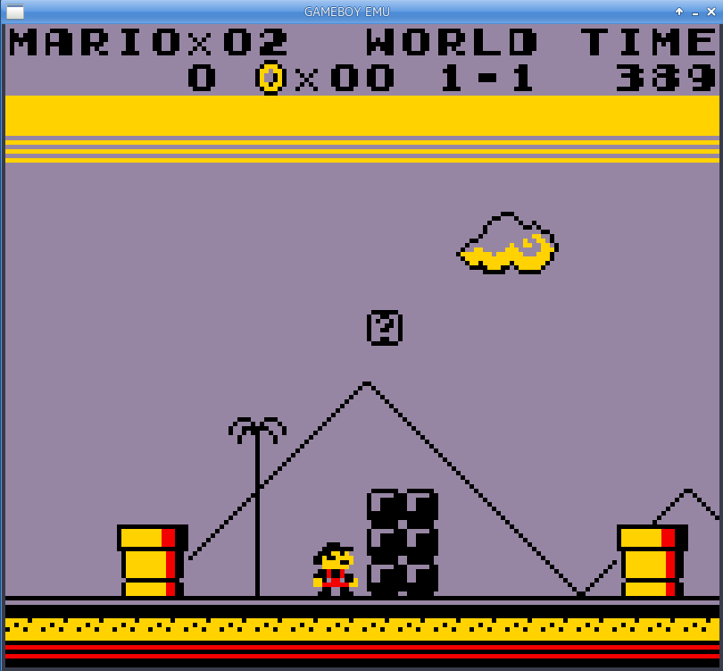
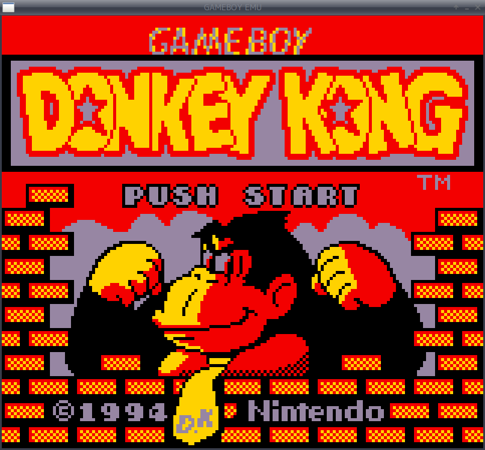
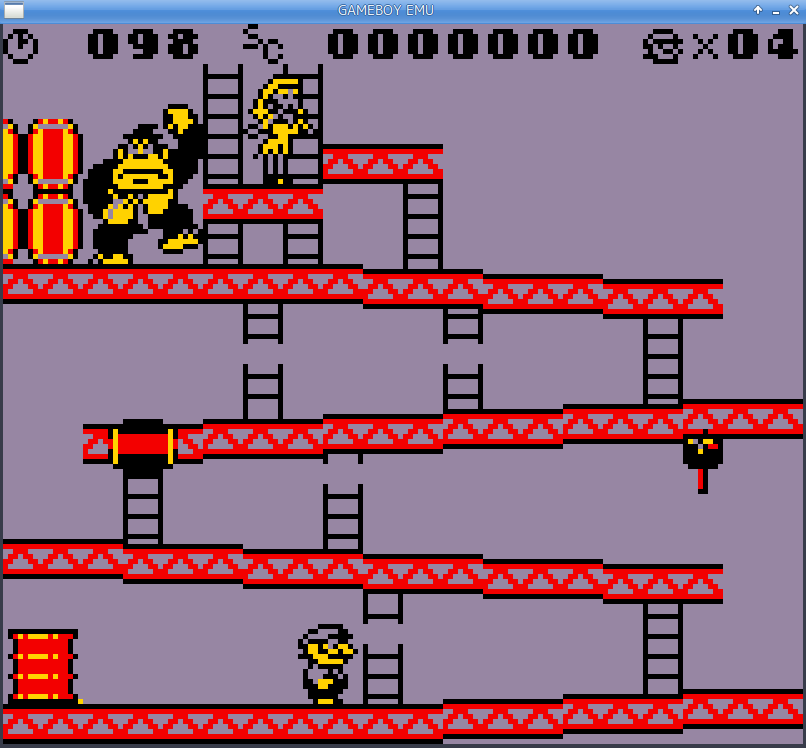
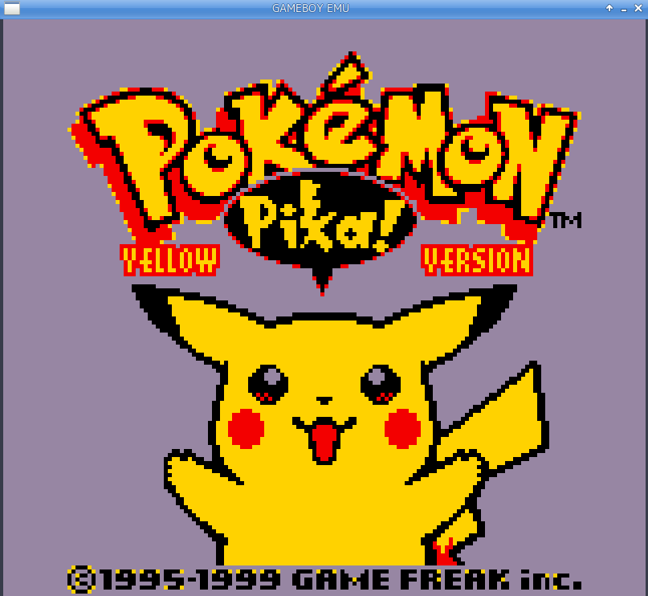
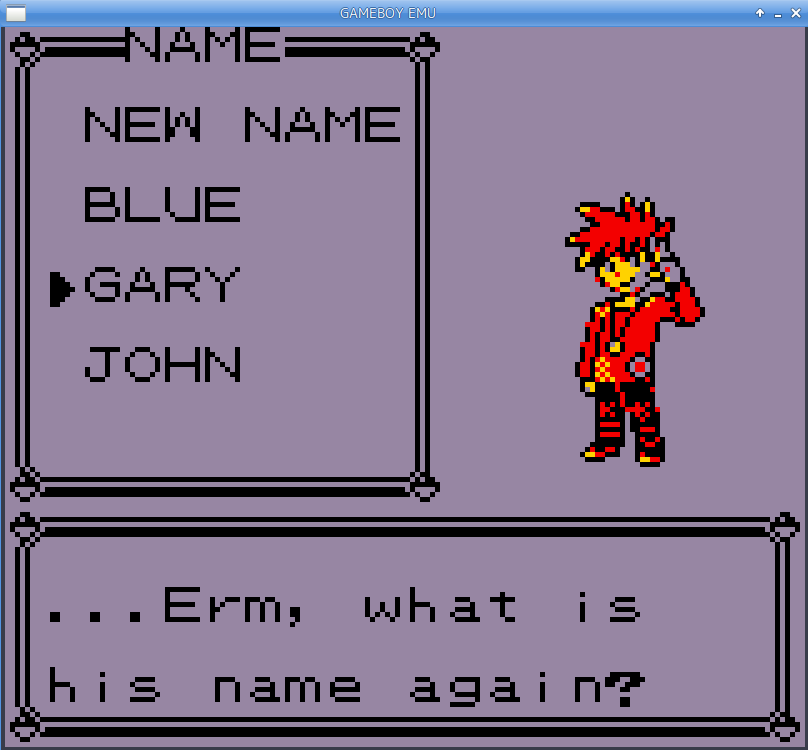
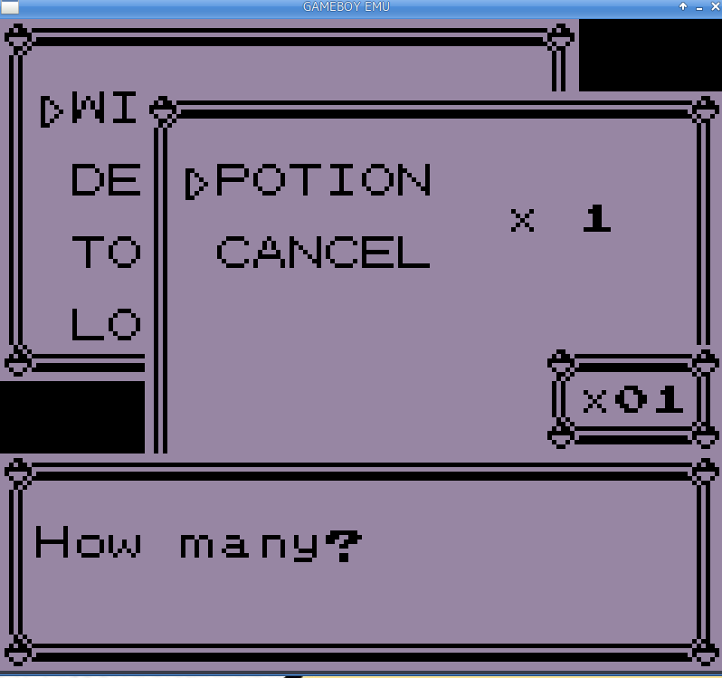
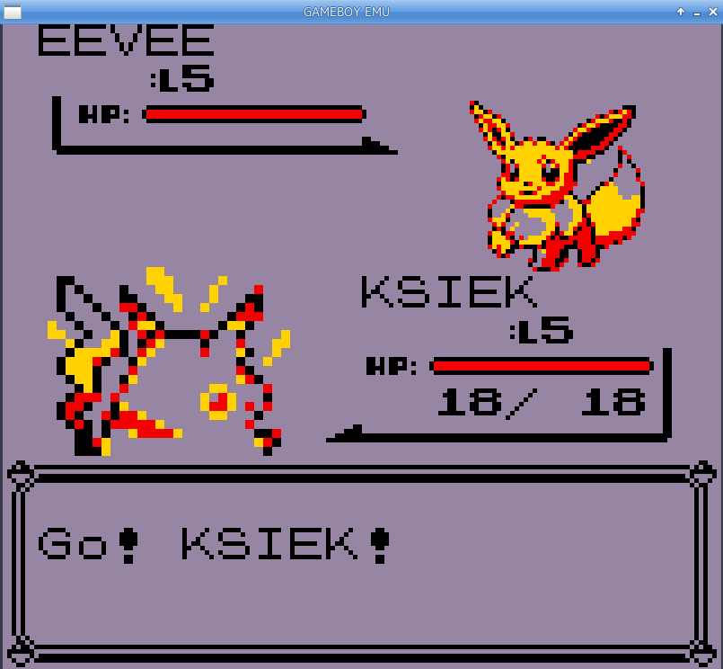
